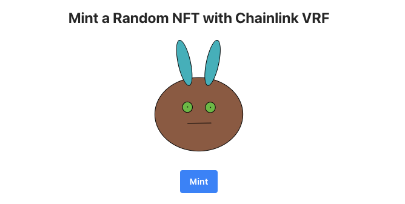

# 🏗 SVG NFT with Chainlink VRF

## [Rinkeby Demo](https://outgoing-apple.surge.sh "Mint a random NFT with Chainlink vrf")
### Built with 🏗 Scaffold-ETH - Typescript



# 🏄‍♂️ Quick Start

Prerequisites: [Node (v16 LTS)](https://nodejs.org/en/download/) plus [Yarn](https://classic.yarnpkg.com/en/docs/install/) and [Git](https://git-scm.com/downloads)

> clone/fork :

```bash
git clone https://github.com/dec3ntraliz3d/svg-nft-vrf.git
```

## Typescript

This is the typescript repo of scaffold.eth. The directories that you'll use are:

```bash
packages/vite-app-ts/
packages/hardhat-ts/
```

## Quick Start

Running the app

1. install your dependencies

   ```bash
   yarn install
   ```

2. start a hardhat node

   ```bash
   yarn chain
   ```

3. Change network, infura key , burner wallet config in /packages/vite-app-ts/.env file.

   VITE_APP_TARGET_NETWORK=rinkeby\
   HARDHAT_TARGET_NETWORK=rinkeby

4. run the app, `open a new command prompt`

   ```bash
   # build hardhat & external contracts types
   yarn contracts:build 
   # deploy your hardhat contracts
   yarn deploy
   # start vite 
   yarn start 
   ```

## Chainlink VRF consideration 

Since local hardhat network don't have a chainlink node to provide random number
we need to deploy VRFCorodinatorMock and Mock Chainlink token which is available on [Chainlink github](https://github.com/smartcontractkit/chainlink) repo. Check /packages/hardhat-ts/deploy scripts for more details on how to deploy mocks. 

## Guides

- Check out [eth-hooks docs](https://scaffold-eth.github.io/eth-hooks/docs/overview) for example of how to use hooks
- you can look at [speedrun ethereum](https://speedrunethereum.com/) to get started with scaffold-eth-typescript and web3.  
  - 🏁 Make sure to click on the typescript tab!

## More Information!
### 📚 Documentation

Documentation, tutorials, challenges, and many more resources, visit: [docs.scaffoldeth.io](https://docs.scaffoldeth.io)

Eth-hooks documentation is [here](https://scaffold-eth.github.io/eth-hooks/).  Learn how to use the contexts here.

### 🏃💨 Speedrun Ethereum
Register as a builder [here](https://speedrunethereum.com) and start on some of the challenges and build a portfolio.

### 🛠 Buidl

Check out all the [active branches](https://github.com/austintgriffith/scaffold-eth/branches/active), [open issues](https://github.com/austintgriffith/scaffold-eth/issues), and join/fund the 🏰 [BuidlGuidl](https://BuidlGuidl.com)!

[Follow the full Ethereum Speed Run](https://medium.com/@austin_48503/%EF%B8%8Fethereum-dev-speed-run-bd72bcba6a4c)


### 💌 P.S.

You need an RPC key for testnets and production deployments, create an [Alchemy](https://www.alchemy.com/) account and replace the value of `ALCHEMY_KEY = xxx` in `packages/react-app/src/constants.js` with your new key.

### 💬 Support Chat

Join the telegram [support chat 💬](https://t.me/joinchat/KByvmRe5wkR-8F_zz6AjpA) to ask questions and find others building with 🏗 scaffold-eth!

### 🙏🏽 Support us!

Please check out our [Gitcoin grant](https://gitcoin.co/grants/2851/scaffold-eth) too!
